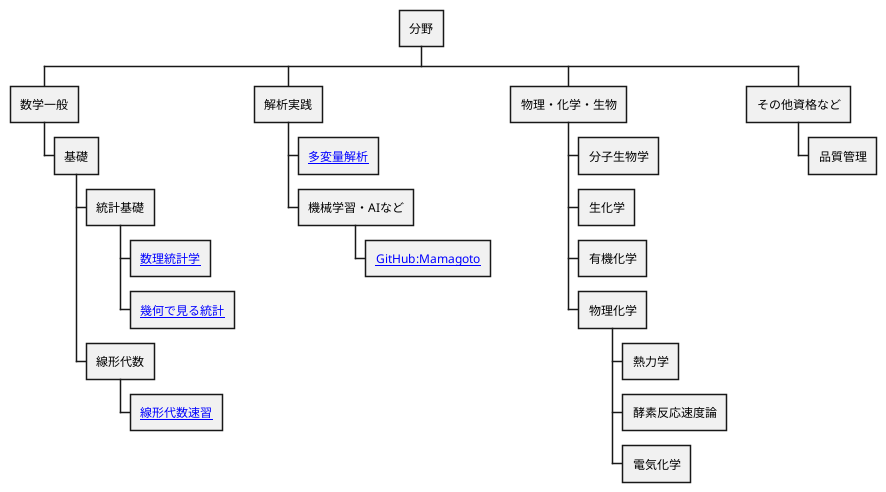

---
export_on_save:
  html: true
---

# 概要

個人のまとめノートです。
同様の形式でノートを作成されたい方は、[[https://github.com/kaY-hR/NoteBook]]をクローンして参考にして戴ければと思います。

コンテンツの間違い・指摘などはページ下部記載の連絡先までお願いします。

## コンテンツ

## 連絡先

[Twitter(X)](https://twitter.com/5fun_dake)
