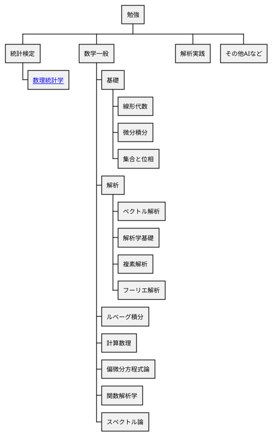

---
export_on_save:
  html: true
---

# 概要

```plantuml
@startwbs
* 勉強
** 統計検定
*** [[index.html?tab=2 数理統計学]]
** 数学一般
*** 基礎
**** 線形代数
**** 微分積分
**** 集合と位相
*** 解析
**** ベクトル解析
**** 解析学基礎
**** 複素解析
**** フーリエ解析
*** ルベーグ積分
*** 計算数理
*** 偏微分方程式論
*** 関数解析学
*** スペクトル論
** 解析実践
** その他AIなど
@endwbs
```